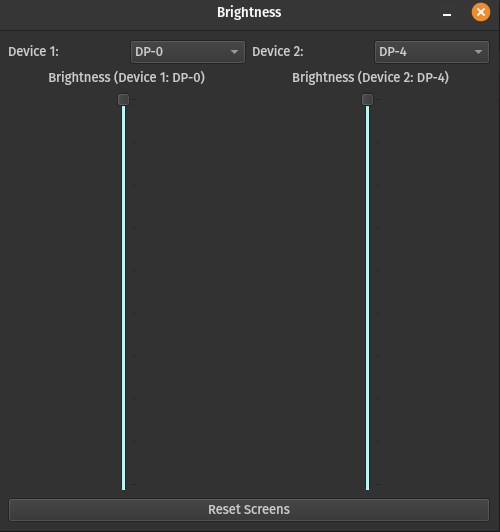

# Linux Screen Brightness Control - GUI

## Version 1.4: GUI Working - Support for 3 Screens - Readme Update

Easily manage screen brightness for up to three displays on Linux with this user-friendly graphical interface. 

---

### Key Features
- **Persistent Configuration**: Your selections are saved each time the program is run. The configuration file is stored in the program directory.
- **Dynamic Device Management**: The configuration resets automatically if the number of devices changes.
- **Simplified Interface**: Once a device is selected, the dropdown option for "Select Device x" disappears to streamline the experience.

- **Reset Button**: If you wish to reset both devices to 100 instantly, you can click the reset button.

---

### Requirements

Make sure the following dependencies are installed:
- **Python** 
- **PyQt6**
- **xrandr**

---

### Usage

1. Ensure all dependencies are installed.
2. Download all python files into desired directory.
3. Launch the program (python main.py).
4. Select the device(s) you want to manage from the dropdown.
5. Adjust brightness levels as needed.

---

### Notes
- Configuration settings will reset if the number of connected devices changes.
- The application currently supports up to **three screens**.

---

## Screenshot

